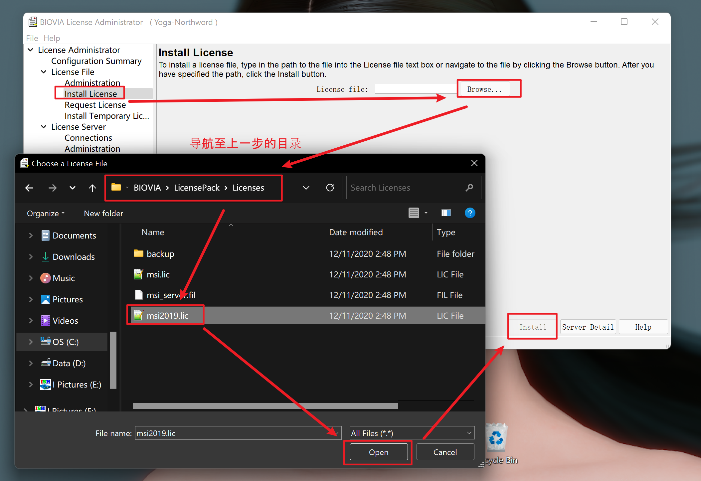

# 计算常用软件

## 列表

本列表中，对于完成课程所必需使用的软件，标注为 `(Required)`，可选安装的软件，标注为 `(Optional)`。

对于 Windows 端的程序，部分关键的安装步骤展示在第二节。Linux 端的程序安装步骤略，不在本节课范围内。

### For Windows

1. 建模软件：Materials Studio (Required)
2. SSH 工具：XShell (Required)
3. FTP 工具：XFTP (Required)
4. X Server：Xming (Required)
5. 开发环境：Python (Required)（含 ase 包）
6. VESTA (Required)
7. 文本编辑器：Notepad++  (Optional)
   Markdown 编辑器：Typora (Optional)
8. GaussView：高斯 (Optional)

### For Linux

- VASP ：集群已安装

- VASP with VTST：若为川大二代集群，可调用我已经编译的

- VTST Script：参见 [VTST-Script | 计算模拟学习笔记 (northword.cn)](https://blog.northword.cn/dft-learning/pages/40eca8/)

- VASPKIT：参见 [安装 VASPKIT | 计算模拟学习笔记 (northword.cn)](https://blog.northword.cn/dft-learning/pages/fce84f/)

- ase：同 Windows ，需安装在 local 。

- gunplot (Optional) 参见 [linux 编译 gnuplot | 计算模拟学习笔记 (northword.cn)](https://blog.northword.cn/dft-learning/pages/a33822/)

- lrzsz (Optional)参见 [linux 安装 lrzsz | 计算模拟学习笔记 (northword.cn)](https://blog.northword.cn/dft-learning/pages/ea401e/)

---

## 安装

由于安装过于简单，故只对部分关键步骤做说明。

### Materials Studio 激活

安装结束后，不要运行软件！把安装包旁的的 `msi2019.lic` 复制到 `C: \Program Files (x86)\BIOVIA\LicensePack\Licenses`


然后启动授权管理器：




### Python

打开安装包后勾选上左下角的 `添加到系统 PATH` 的选项后再进行下一步！

### ASE 安装

由于 Python Pip 默认源服务器在境外，速度较慢，故须换为国内镜像源或配置科学上网。以下安装命令已配置为清华大学镜像源，在已配置 Python 的环境下，执行：

```
pip install ase -i https://pypi.tuna.tsinghua.edu.cn/simple
```

## 一些资料

- [PIP 换源](https://www.jianshu.com/p/b2412f7fc93f)
- [不完全不准确不系统的计算模拟入坑记录 | 计算模拟学习笔记 (northword.cn)](https://blog.northword.cn/dft-learning/)
- [不完全不准确不系统的计算模拟入坑记录 | 计算模拟学习笔记 (gitee.io)](https://northword.gitee.io/dft-learning/)
