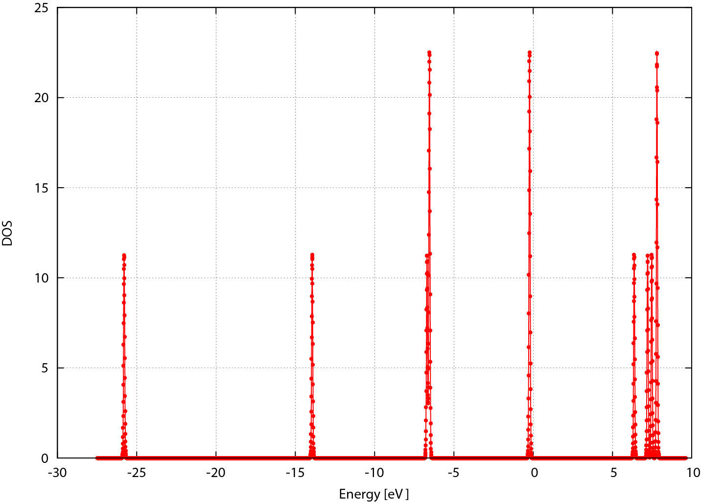

# 态密度分析

态密度，也就是每个轨道的电子云分布比例，通过态密度可以了解电子结构。

在**非自洽计算**的基础上进行态密度分析。

本页以计算 O2 的态密度为例。

## 步骤

本页操作在完成 [O2 结构优化、自洽、非自洽](..\02.结构优化与静电自洽\02.vasp-opt.md) 之后进行。在`3-nscf`文件夹中继续。

计算完成后用 `VTST Script` 的脚本 `split_dos` 分离态密度：

```bash
[zjb@op 3-nscf]$ split_dos
The OUTCAR exists, we use it to get the Fermi level,
the RWIGS tag and the number of spins.
Fermi level: -6.6846
Spin polarized calculation
LORBIT = 11
WARNING: not completely test for vasp.4.*
Use at your own risk. Please check results for consistency.
7 6006
0 7 6006
1 6008 12007
2 12009 18008

[zjb@op 3-nscf]$ ls
CHG     CONTCAR  DOS1  DOSCAR    IBZKPT  KPOINTS  OUTCAR   PCDAT   POTCAR  REPORT  tmp.dat   vasp.pbs     WAVECAR
CHGCAR  DOS0     DOS2  EIGENVAL  INCAR   OSZICAR  out.log  POSCAR  PROCAR  stdout  tmp.dat2  vasprun.xml  XDATCAR
```

这一命令后得到了 `DOS0`、`DOS1`、`DOS2` 三个文件，DOS0 是总的态密度，DOS1 和 DOS2 分别是第 1 个 O 原子，第二个 O 原子的态密度。

使用脚本画图：

```
dosplot.pl DOS0
```

执行后生成了 `dosplot.eps`，下载，使用矢量图工具打开。



也可以将 `DOS0` 回传，使用 Origin 画图。
